## AWS Developer Associate questions

## DynamoDB

## AWS Elastic BeanStalk

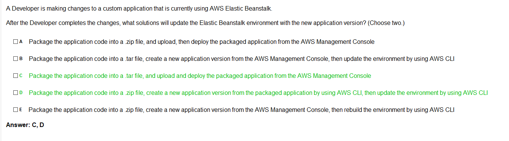

## Cognito

**Cognito Links**:
* [FAQs](https://aws.amazon.com/cognito/faqs/)

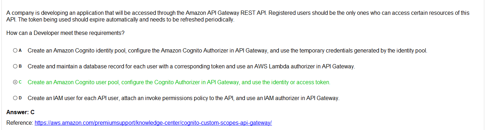

[https://aws.amazon.com/premiumsupport/knowledge-center/cognito-custom-scopes-api-gateway/](https://aws.amazon.com/premiumsupport/knowledge-center/cognito-custom-scopes-api-gateway/)

## VPC questions

## CloudWatch questions
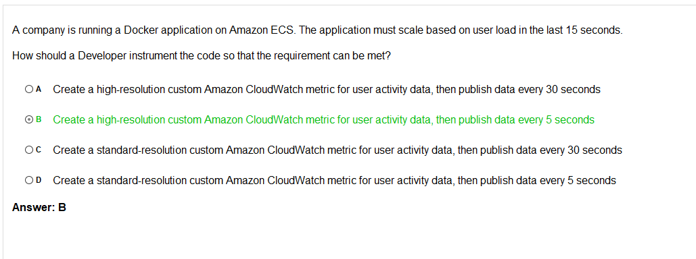

## API Gateway questions

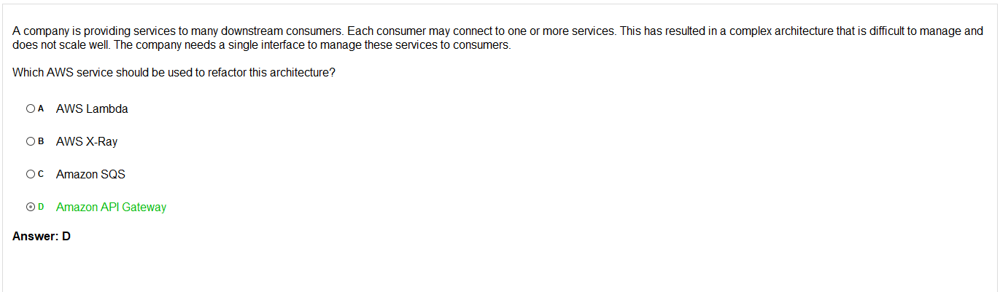

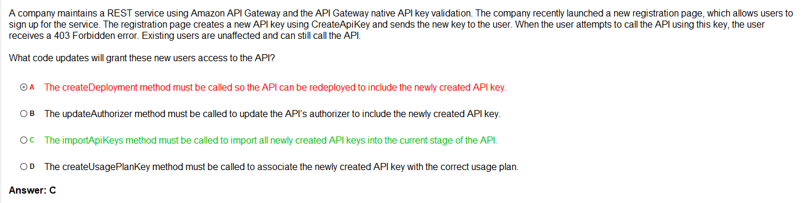

## AWS Lambda questions

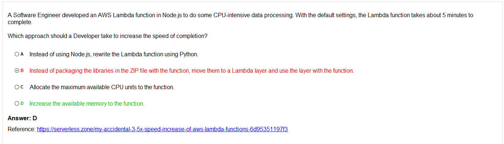

* [Scaling Lambda functions](https://serverless.zone/my-accidental-3-5x-speed-increase-of-aws-lambda-functions-6d95351197f3)

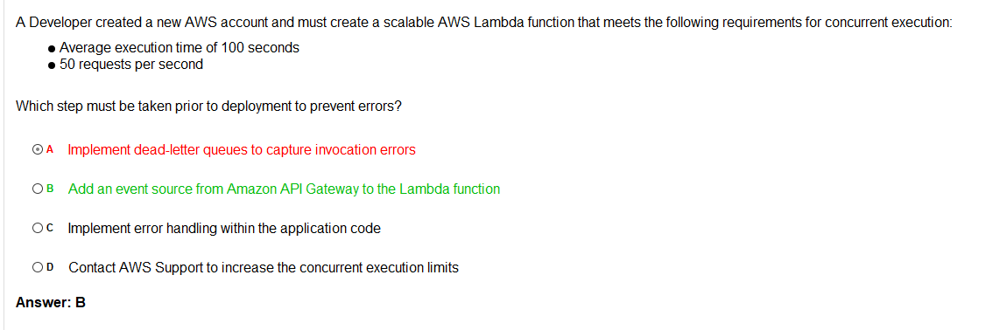

**Controversial**:

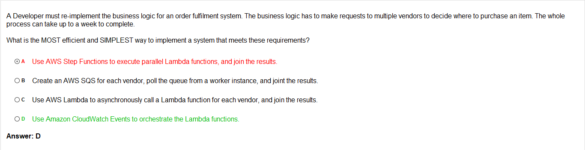

### AWS Lambda security questions

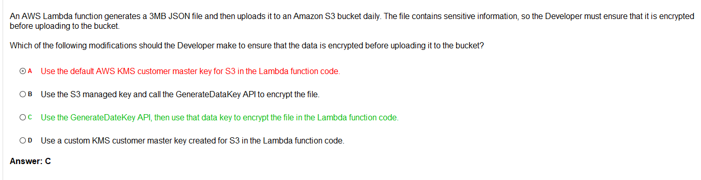

## Loadbalancing questions

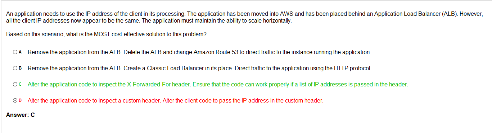

## AWS X-Ray

# AWS Storage

## AWS EBS

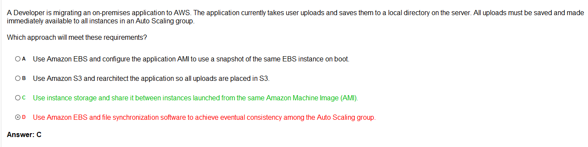

## AWS S3

## AWS ECS

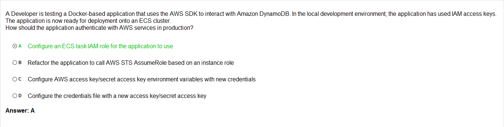

## Bullshit questions

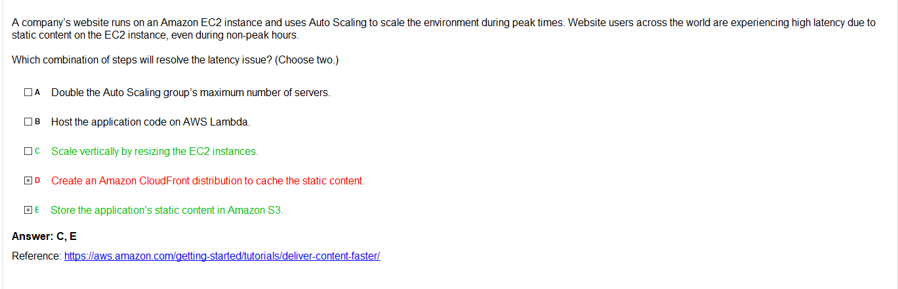

[Reference: Deliver Content Faster](https://aws.amazon.com/getting-started/hands-on/deliver-content-faster/)

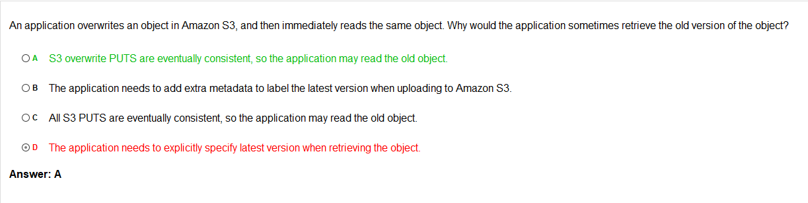

## AWS Security
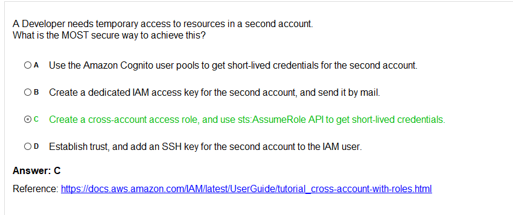

[Delegate Access Across AWS Accounts Using IAM Roles](https://docs.aws.amazon.com/IAM/latest/UserGuide/tutorial_cross-account-with-roles.html)

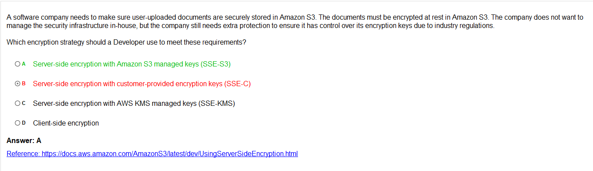

