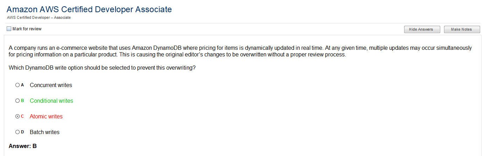
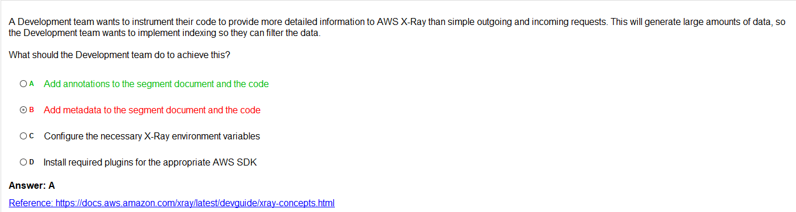

## AWS Developer Associate questions

## DynamoDB

## AWS Elastic BeanStalk

## Cognito

**Cognito Links**:
* [FAQs](https://aws.amazon.com/cognito/faqs/)

[https://aws.amazon.com/premiumsupport/knowledge-center/cognito-custom-scopes-api-gateway/](https://aws.amazon.com/premiumsupport/knowledge-center/cognito-custom-scopes-api-gateway/)

## VPC questions

## CloudWatch questions

## API Gateway questions

## AWS Lambda questions

* [Scaling Lambda functions](https://serverless.zone/my-accidental-3-5x-speed-increase-of-aws-lambda-functions-6d95351197f3)

### AWS Lambda security questions

## Loadbalancing questions

## AWS X-Ray

# AWS Storage

## AWS EBS

